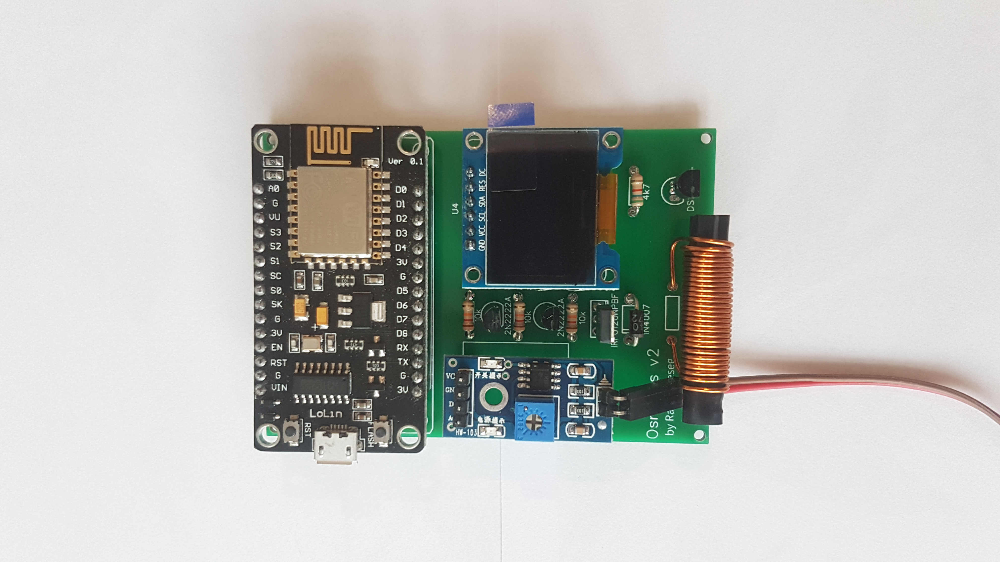

# OsmoZis v2

Do you need to dry out your house from rising water? Typically an older hour or a house with problematic fundament insulation?

Well without too much of the theory, there is chance a small gadget like this would help.

# How does it work?
Simply said, the equiplent generates low frequency peaks which eliminate force existing in the water/wall solution and keeps let the gravitation win the  fight of various forces and drop the water down, back to the ground.

Sounds like magic, well, most likely it does, however it was successfully tested experimentally.

If you need more details or theory provoded by experts, seach on internet for articles or videos that might help you to understand the magic. One iteresting I have personally found is  following https://www.youtube.com/watch?v=hDw9_C7s-Mk.

# Does it exist in market?
Of course it does, just search OSMO something ... The devices are far to expansive and some of them just show a led diode shining, without a chance to see wheter it really works or not.

This simple and cheap device, which cost fraction of what you can find on market gives provides functions where you can:
* observe moisture on display
* observe temperature on display
* connect the device to your wifi
** see IP address of the device on display
** see time
* and setting
** to set time zone offset
** send data to thinkgspeak to see moisture/temperature online every 10 minuts by default (customizable based on your preferences)

# What do you need to make your own device?
check the "img" folder, there you can find design of the circuitry, PCB gerber file and several pictures that might help to make a final good.

# How to make it breathing?
Just use the piecce of code and check the software, or in case you dont want to bother, just use the bin file and flash your own ESP directly.

If you are interested in the code, be aware of several external libraries that are needed, find the list below.

1. include <OneWire.h> 
2. include <DallasTemperature.h>

3. include <SPI.h>
4. include <Wire.h>
5. include <Adafruit_GFX.h>
6. include "Adafruit_SSD1306.h"

7. include <Interval.h>
8. include <ThingSpeak.h>

and of course finally
9. ESP8266 board and libraries
